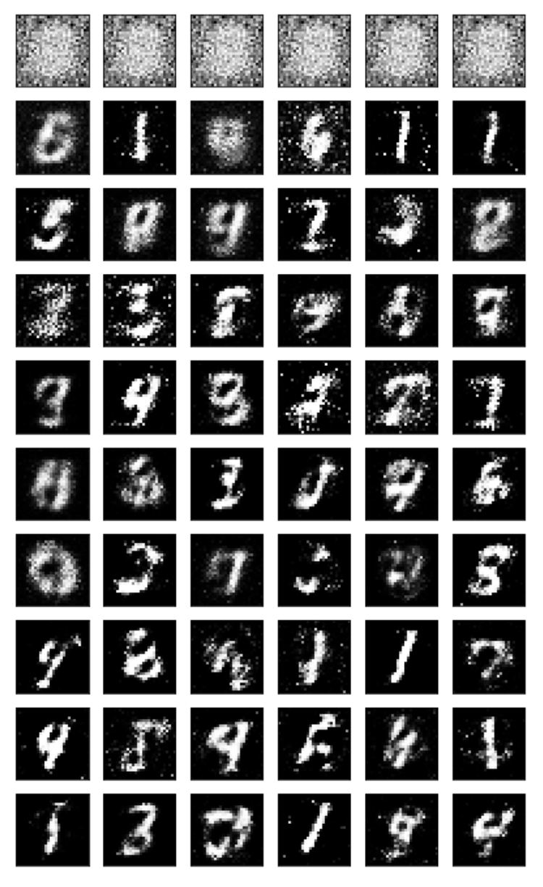

# GAN generating hand-writting image with MNIST training data

Udaicty의 프로그램을 따라가며 메모한 내용

## Generative Adversarial Networks (GANs) 

* GAN을 어떻게 활용할 수 있는지
* GAN의 동작 원라
  * 비지도 학습
  * discriminator를 만들어서 사진이 진짜인지 가짜인지 판별
* Adversarial 의미 = 2 network (generator, discriminator)
  * 경쟁 모델, 게임 이론을 활용하면 수학적으로 이해하기 쉬움
  * Game theory - payoff, equilibria
  * equilibria를 고차원에서 찾을 수 있는 cost function이 필요
* GANs을 학습하는데 유용한 팁들
  * generator & discriminator 는 각자 하나 이상의 hidden layer가 있어야 함
    * Leaky ReLu
      * negative value -> 0.01, 0.1.. 등 작은 수로 변환
      * positive value -> 일반 ReLu와 같음
    * generator의 output에는 hyperbolic tangent를 사용
      * tanh
        * similar with sigmoid but |output|<1
        * MNIST 데이터를 rescale해서 discriminator에게 넘겨줄 때 |value|<1 형태가 되도록 해야함 (원래는 0<value<1)
  * GANs는 동시에 두가지의 최적화 알고리즘을 사용한다는 점에서 다른 네트워크들과 다르다
  * What we need to do to scale GANs up to large images = Scale up classifiers to work on large images
    * CNN 활용
    * (z->reshape->convol+LReLu->convol+tanh->convol+LReLu)->(reshape->matmul+sigmoid) generator->discriminator
    * reshape batch nomalization
  * GAN 만들기
    * GAN을 만들고 MNIST 데이터 셋으로 학습시킨다
    * 학습된 GAN으로 새로운 손글씨를 만든다
    * tensorflow
      * tf.placeholder
        * lazy evaluzation 형식은 tensorflow에 맞게, 변수의 타입을 미리 설정해놓고 필요한 변수를 나중에 받아서 실행.
      * tf.variable_scope
        * 한 번 생성한 변수를 계속 재사용하기 위해서 사용
      * tf.layers.dense
        * densely-connected layer의 tf 구현체
        * inputs = 입력 네트워크
        * units = layer의 생성 시점 크기를 의미
      * tf.reset_default_graph()
        * 모델을 새로 만들 때 이전에 생성한 모델들을 지워주는 역할
      * tf.trainable
        * train할 수 있는 변수, 객체들을 반환
    * losses
      * discriminator's total loss 
        * real image loss + fake image loss
    * lable smoothing
      * discriminator가 잘 generalized 되기 위해 사용
      * p<~1, (p*label)
    * optimizer
      * AdamOptimizer가 쓸만함 
      * generator, discriminator training

epoch에 따라 random vector가 hand-writting number로 변하는 결과.

## How to improve it

* 여러 개의 hidden layer 시용하기
* [Improved Techniques for Training GANs.](https://arxiv.org/pdf/1606.03498.pdf) 논문 참고
* 3개 이상의 hidden layer를 batch nomalization 필수

